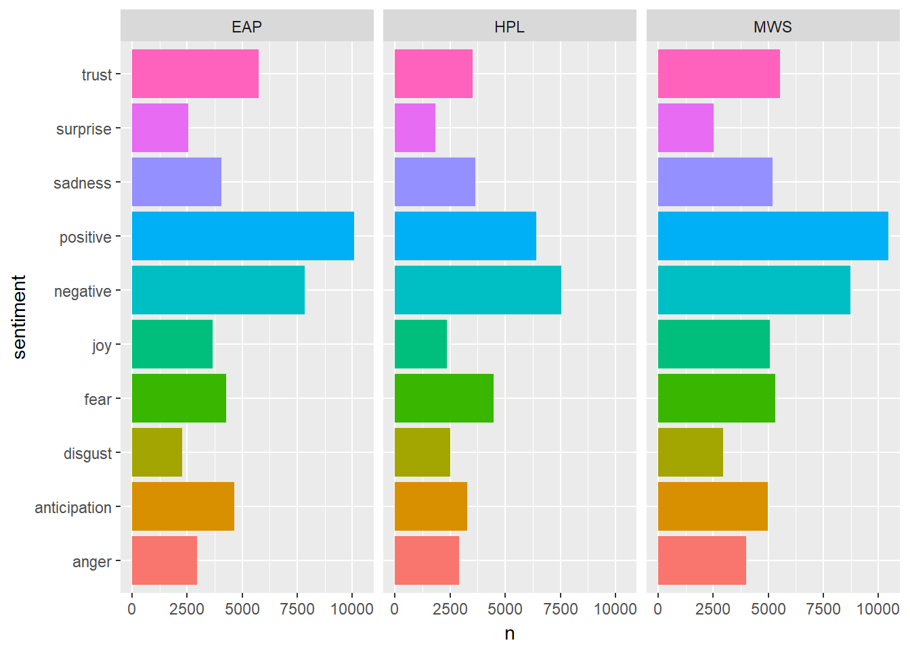
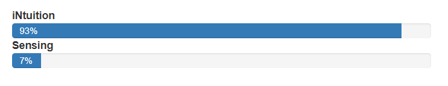

# Spooky Text Analysis and Inference #
In this project, I will illustrate basic text analysis techniques and more advanced explorations of textual patterns between authors that could lend more inference to identifying eahc unique author. 

# Step 1 - Data Prep #
In this step we parse out each individual word for each author, EAP, HPL, and MWS. I then create two different data frames, one with every parsed word used by each author, and one with only unique words that do not include common words like "and", "of", or "but". These two dataframes will be used later for various types of analysis, along with the original data set which includes full sentences from each author. 

# Step 2 - Looking at Word Frequency #
In this step we look at word frequencies for both the unique words and common words, and illustrate their relative frequencies through word clouds. 

Next we look at the word frequencies of each individual author, to get a foundation on the language that they use and how they use it. We can see that MWS uses words like "life" and "love" far more frequently than the other authors, which gives us interesting insight into the types of subjects she may write about. When looking at the more common words, we see that EAP uses "the" significantly more than the other users, but the other common words are somewhat similar to one another, suggesting that the share similar writing tactics, and a shared language structure. 

# Step 3 - Advanced Frequency Analysis #
Having the raw data in regards to frequency of words used is interesting and allows us to begin to build better inference about the authors, but it is perhaps more interesting to look at how long between each usage of a word it takes for them to use it again. 

To do this, I split the tokenized word data into 3 different data sets, containing only a single author. I then used a loop to count how long it took between each usage of common words like "and", "but", and "which" it took for the author to use again. I selected these 3 words to give initial insight into how they may be structuring their sentences. Are the adding multiple thoughts into single sentences frequently, are they keeping the reader on edge by giving new and contradictory information frequently, or are they needing to explain more to further the plot. 

Looking at the graphs, we can see that it is hard to truly parse any information from this just by looking at it. However, we can see that EAP oftens goes longer without using "and" and "but", but shorter amount of time or "which". This could be symptomatic of his writing style being one where he keeps a lot hidden from the reader until certain points in the text where he does a big reveal. 

Here is a look at the mean frequency between "and", "but", and "which"

Why might this type of frequency analysis be interesting in identifying particular authors? Although, the inference may be hard to tell from visual inspection a lot could be done with this. 

1. If you have that computing power and time you could calculate these frequencies for each word. Then by calculating the average frequencies you can essentially build a unique number or "barcode" of sorts that would identify an author. If trying to compare that to a smaller corpus however, you may get some variation. 
2. To solve that issue, this data would be a great data set to use resampling techniques like a bootstrap method to determine likelihoods of at what frequiency a particular word will appear. Unfortunately, I did not have time to do this, but you could build sampling distributions that would give you insight into the sentence structure and unique writing styles of each author. 
3. The originial data set was not in the same order as it appeared in their actual books / writings, but if it were it would be very interesting to do this same technique and then pair it with time series analysis and hidden Markov models for text classification. In doing so not only would it give insight into their writing habits, but it would give you insight into how their style changes as a story progresses. 

# Step 4 - Simple Data Visualization #
The data that we see visualized here can help us explain a little more of what we found prior to this. Reasons why EAP might use more of a certain word could be because of the fact that he just uses more words in general, although his senetence length is likely to be shorter than the other authors. Overall, all the authors seem to have a similar distribution for their word length, with EAP having ever so slightly longer words on average. 

# Step 5 - TF-IDF #
With this analysis it is easier to see what unique words each author uses. Many times these unique words are names for obvious reasons. However, each author does have their own unique colloquialisms and in the case of HPL, even makes up his own words. 

# Step 6 - Sentiment Analysis #
In this we look at various sentiments from the words each author uses. This sentiment, positive, negative, or otherwise, is used to analyze the sentiment of single words, so in context the sentiment can be completely different. However, when looking at how many times a word is used by an author it can give you an overall idea about the sentiment of their writing. 

# Step 7 - Myers Briggs Personality Analysis #
Building off the sentiment and word usage, you can also begin to understand the personalities of each author and how that might sway the way they write. My combining all of each author's corpus and calling the uClassify API Jon Kagstrom, which was trained on the data set produced by Jensen & DiTiberio, 1989 in a study, we can analyze the 4 different aspects of Myers Briggs using binary classifiers for: Attitude, Lifestyle, Perception, and Judgement.

For EAP we see that he is an INTP, doing a brief Google search we can see that the assessment is actually quite accurate. Depending on whom you ask, he is either INTP of INFP, which explains why his T and F scores are the closest together. 

For HPL we see that he is ENFP, the internet seems to think that he is INFP, but if you have read HPL you can see how he might be the most extraverted of these authors. 

For MWS we see that she is INFP, again, the internet seems to confirm this finding. What is interesting about MWS is that her scores are the most drastic in a particular direction, which might suggest that she has a much more singular way of writing compared to the other two, which would allow us to build inference from this. 

Again, a resampling method like a bootstrap would be good to do on analysis like this so that we can get a distribution that could help us more accurately define each author. 

Ultimately, there are a million and one ways to analyze text data, but these methods should be a good beginning in trying to define how to best tackle the case of author identification. 
